<h1>  Data Structures II Project : K-D Trees </h1>

## Introduction to K-Dimensional Trees:
---
A K-Dimensional Tree is a binary search tree where data in each node is a K-Dimensional point in space.

A node in the K-D tree divides the space into two parts at the axis of the level the point exists. A KD-tree induces a space subdivision-each node introduces an x- or y-aligned cut.
Points lying on two sides of the cut are passed to two children nodes.
The subdivision consists of rectangular regions, called cells (possibly unbounded). Here is an example of KD-Tree partitioning.

<p style = "text-align:center;">

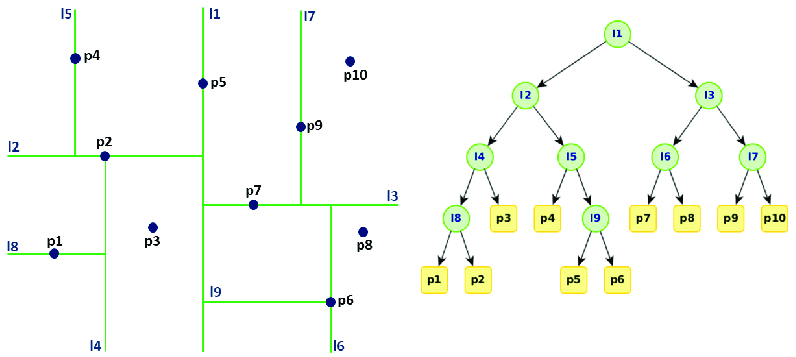

Source : [KD Tree Visualization](https://www.researchgate.net/figure/Visualization-of-the-k-d-tree-algorithm_fig4_327289160)

</p>

## Instructions to Run Application

To run the Web Application on your local server, clone the repository on your machine and run the following commands in the root location of the repository.

```bash
pip install virtualenv
virtualenv env
.\env\Scripts\activate
pip install -r requirements.txt
npm i
npm run build
python manage.py migrate
python manage.py runserver
```

### *Complexity Analysis*

To get balanced trees, use the median coordinate for splitting - median itself can be put in either half or Presort points by x and y-coordinates, and cross-link these two sorted lists.

1. With median splitting, the height of the tree guaranteed to be O(log n).
2. Inserting a new point into a balanced k-d tree takes O(log n) time.
3. Removing a point from a balanced k-d tree takes O(log n) time.
4. Finding 1 nearest neighbor in a balanced k-d tree with randomly distributed points takes O(log n) time on average.

### *Nearest Neighbour Search*
 The NN algorithm finds the point in the tree that is nearest to a given input point. For k-dimensional points, KD-Tree properties quickly eliminate large portions of the search space. Kd trees are generated with every node corresponsing to a splitting dimension which acts as the splitting axis for our kd tree that is, for the incoming new node: at any level, we compare that level' splitting dimension value of the already existing node to the incoming node's value at that same dimension and depending on that we choose to move either left or right if value is lesser or greater respectively. Therefore, every node allows us to have a vision of the region that lies above it in terms of values and below it. Therefore, for any given point, we can reach either reach the node if its present or narrow down to a leaf which precisely tells us where the node must lie and therefore its ancestor node was the nearest node whose splitting axis told us where the desired node will finally lay. This nearest neighbor search saves alot of time and resource as we narrow down to the nearest neighbor by space partitions. An intuitive idea can be seen from the image below.
<!-- Alignment options!!!!! -->
<p style = "text-align:center;">

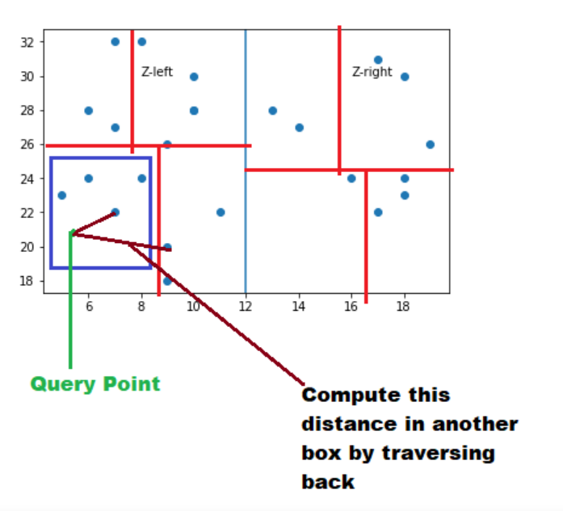


Source : [Nearest Neighbour Search using KD-Tree](https://kanoki.org/2020/08/05/find-nearest-neighbor-using-kd-tree/)

</p>

## Application : Copy Move Forgery Detection
---
Forgery has been a major security issue since before computers even existed. In the digital age, however, with editing softwares becoming more and more sophisticated, the act of forgery has become less and less identifiable. From fake news and memes, to mass propaganda and false evidence: it affects both the individual, and the masses. 

Copy move forgery is one such form of forgery, where essentially a part of the image is copy pasted into the same image in a way that it looks natural to the human eye. The aim of this tool is to identify and highlight this copy pasted portion to help us distinguish fake from the original. In this ever evolving cyber era, this will prove to be  a great tool to ensure honesty and originality of media.

## Algorithm

The primary algorithm for this problem has been adapted from the paper "A Fast and Accurate Algorithm for Copy-Move Forgery Detection" by Abdullah Moussa. The implementation has been done from scratch in Python. Below is the general outline we have followed to detect the duplicated image regions.

<p style = "text-align:center;">


Source : [Nearest Neighbour Search using KD-Tree](https://kanoki.org/2020/08/05/find-nearest-neighbor-using-kd-tree/)

</p>

Here parameters and key variables are,

1. SI is the suspicous image input.
2. $\alpha$ is the threshold for the SAD between color channels of pixel pairs.
3. $t_m$ = problem-dependent threshold between 0-1 
4. $\eta^2$ = block size
5. $C_f$ = correlation factor or the total no of pixels pairs where  SAD > $\alpha$

## Image Detection Gallery
The processing precision of our algorithm can be observed in these generated outputs where the forged areas are identified with narrow details. This high precision, however, requires time trade off as the pixel-by-pixel processing is time extensive.
Use the package manager [pip](https://pip.pypa.io/en/stable/) to install foobar.


<p style = "text-align:center;">

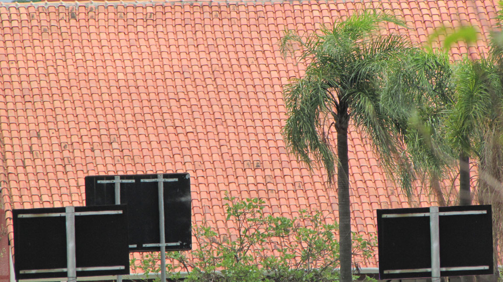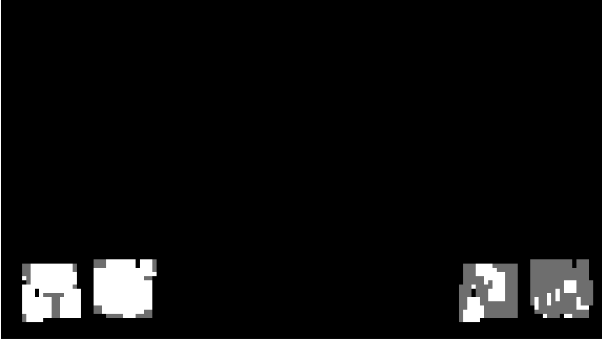

<br/>

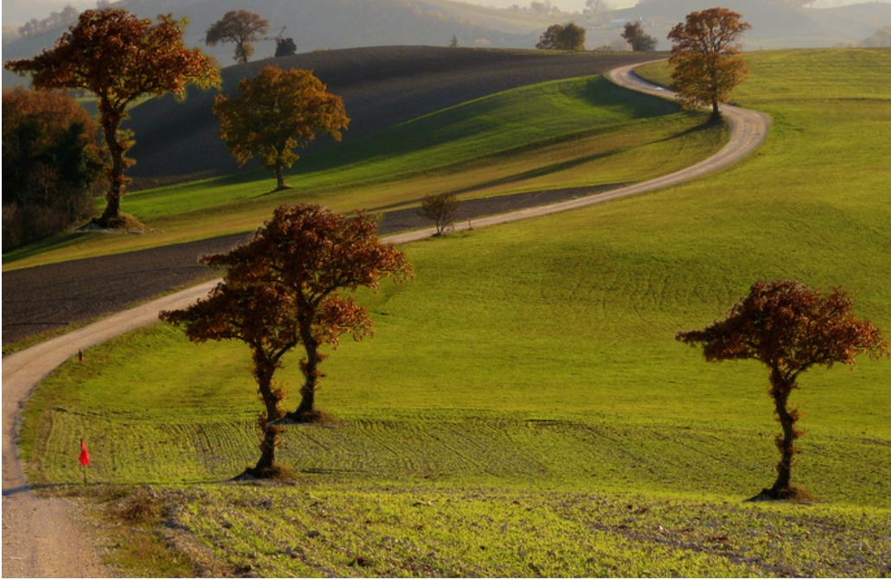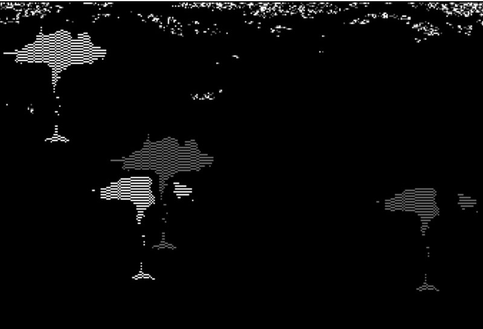

</p>

## Application : Generative Art Using K-D trees
---
MathArt and GGplot library of R programming language have been used to generate art and images. The following general strategy is used to make the images we have featured in the gallery below.

1. Generating 2-D points randomly or mapping them onto some equation.
2. Making a KD Tree of those points.
3. Getting the end points corresponding a point (x,y). 
4. Tweaking the parameters according to the art style.
5. Plotting them with artsy techniques, colours, linetypes, sizes etc.

There are two images of Rapidly-exploring random trees which are extension of KD-Trees since they are two dimensional but their construction is completely randomized and different.  RRT grows a tree rooted at the starting configuration by using random samples from the search space. As each sample is drawn, a connection is attempted between it and the nearest state in the tree. The built in functions of mathArt library nearly accomplish all of that by generating the search space. The images featured in blue are examples of RRT Art.
<br/>References: https://towardsdatascience.com/getting-started-with-generative-art-in-r-3bc50067d34b


## Our KD-Art Collection
Below are the few images we have generated by generating random points and creating KD-Trees. Ggplot has been used to plot the KDTree generated data frame.

KD Art            |  Premium Images
:-------------------------:|:-------------------------:
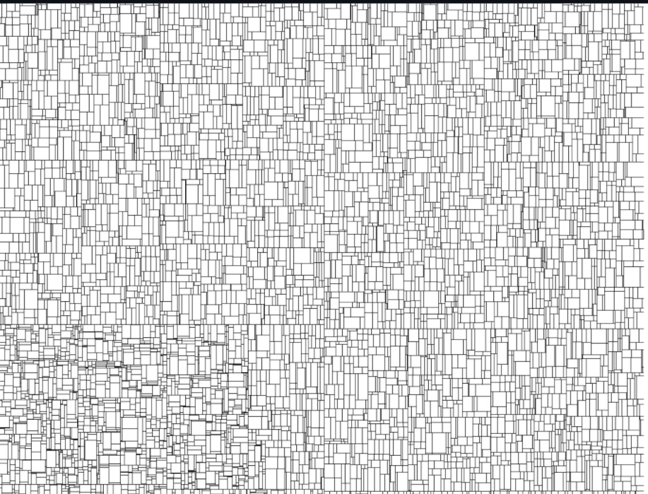  |  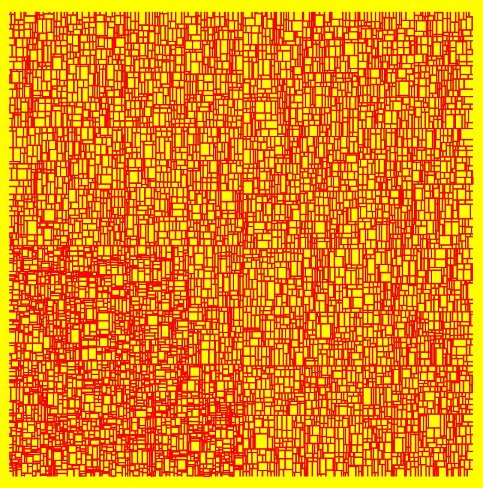
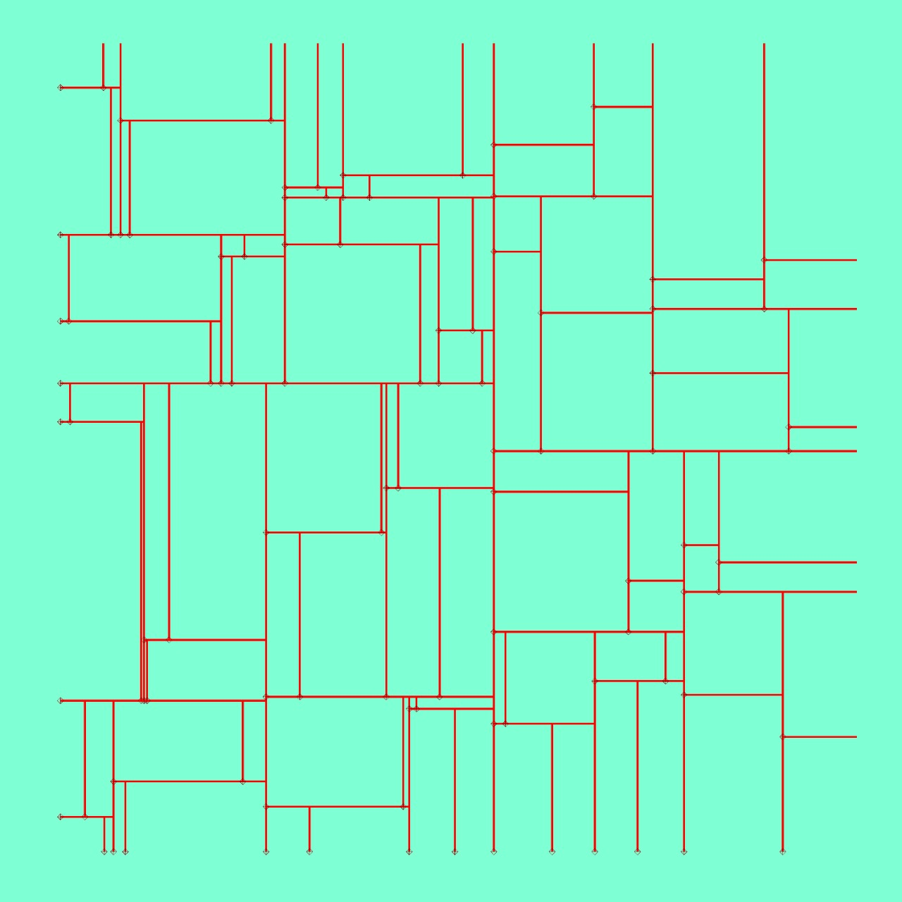  |  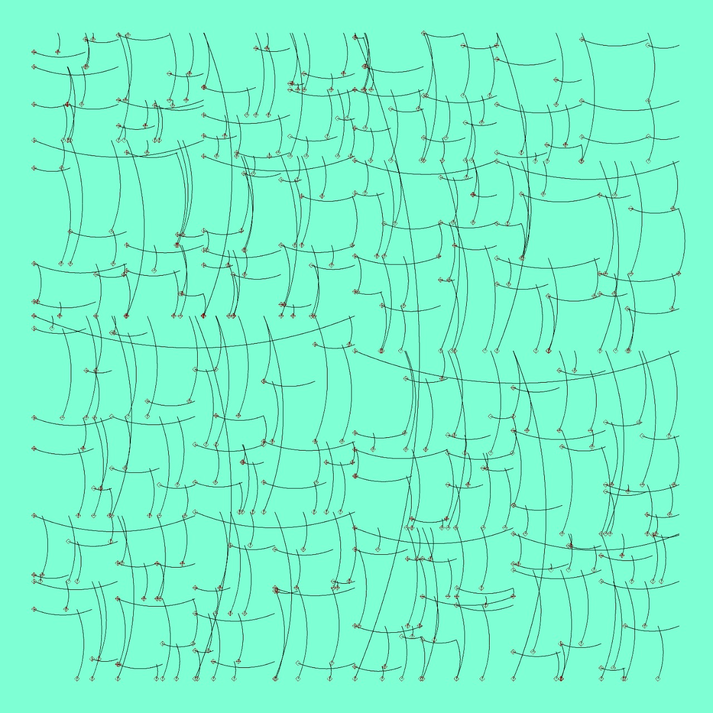

In the images below, points are not created randomly. Rather random points are being created that lie within a disc (using equation of circle), that lie on an ellipse, that lie on a straight line $y = mx +c$.
KD Art  |  Collection
:-------------------------:|:-------------------------:
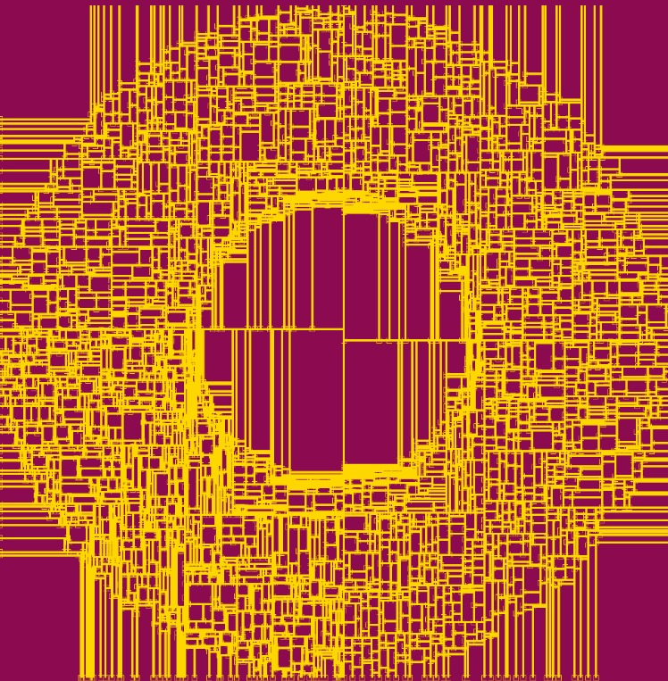  |  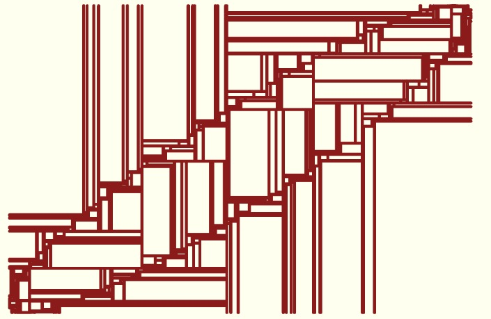
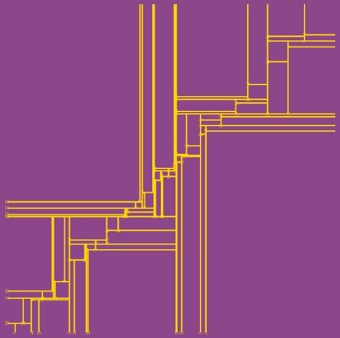  |  

In the images below, are that of a Rapidly Exploring Tree mentioned above. Code reference is stated above.
KD Art            |  Premium Images
:-----------------:|:-------------:
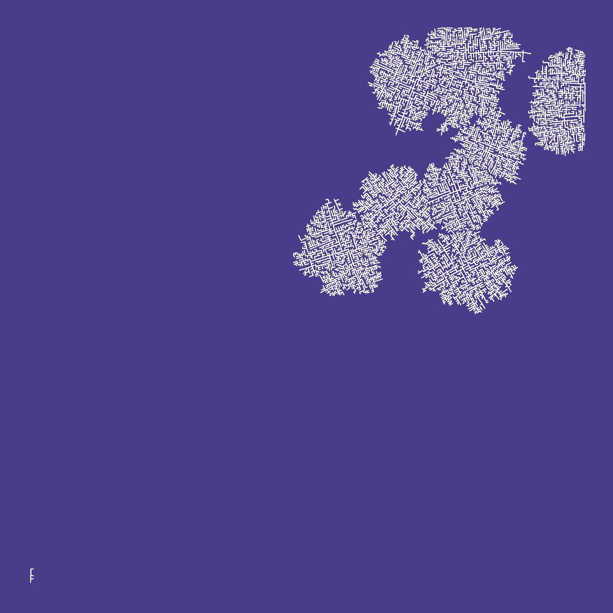  |  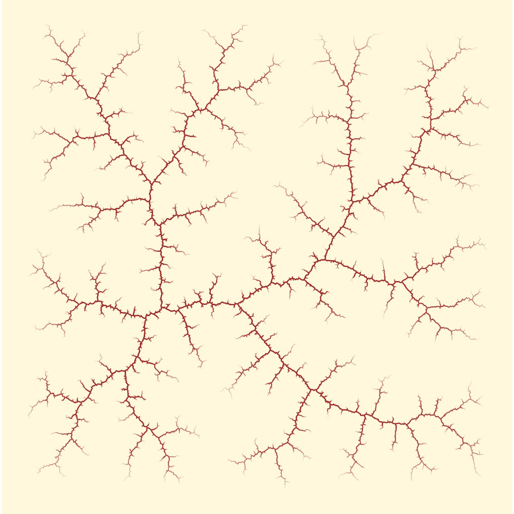


### Thank You
---


